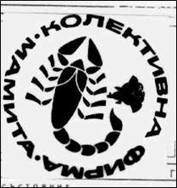
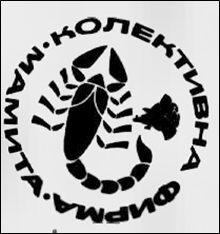

## Summary

Noise image filtering (suppression) is a classical problem in the area of "Image processing and Recognition ". Privately, the problem is connected with the image data base systems (IDB), where these days are used CBIR approaches (Content Based Image Retrieval) for data access. The CBIR approach must supply a given level of noise stability, at least about the regular noise, typical for the process of image acquiring.
There are cases, where the noise in the input image can’t be interpreted like regular, but more like noise of kind of so called “artifacts” – often located in the image periphery. In the current analysis we are looking for a method for isolating the above "artifacts", which often cover the object to be recognized so much, as the simple geometrical approaches for isolating doesn’t work.
A method is given for suppression artifact-noise influence when methods for DB image retrieval are used. An example for system of this kind is EFIRS (Effective and Fast Image Retrieval System) developed in IIT-BAS requisite to the Patent Office of the Republic of Bulgaria and more exactly – about their large IDB with images of professional stamps.
The prior information, used in the method, which serves as a basis in the analysis how much a given object is classified as artifact, we are formulating with the conditions below:
* The input image is binarized in advance
* The content of the stamp is regarded like localized mainly in the image center
* The rough artifact noise is assumed to be concentrated in the image periphery.
* The main object and the artifacts to be demarcated like different forms.

We bring a new morphological transformation, which we call as development contour tree in distance transformation (DCTDT). The transformation uniformly projects arbitrary binary image in a tree structure. It is proven that after distance transformation (DT) over binary image, the contours following arbitrary level of the pixel intensities are included in the contours of higher level of pixel intensities, until the maximal intensity is achieved - equal to the maximal distance between two objects. The uniformly representation of a binary image using DCTDT derives from the used full information in the DT, which follows that DCTDT transformation can be reversed. DCTDT has a property to represent the distance, as between the contours of first intensity level (traversing intensity 0 in DT), but also between contour groups in the higher intensity levels from DT. The following DCTDT properties are directly used for extracting probability valuation about how much a given object is artifact.
* the branches number of a given node represents the amount of close objects (leafs) or group of objects (sub-trees)
* as node is more deep in the tree as the represented object is more close to the main group of objects in the image

Using the given properties as a basis, and recursively traversing the tree up-bottom, we are building a probability valuation first about the object groups, and then about the initial objects how much they represent artifacts. To achieve full probability valuation from all levels of tree development, the medium valuations (for the object groups) are sequentially multiplied trough the path from the tree root to the tree leaf. The result valuations for all leafs (initial objects) are normalized in the interval [0, 1] and they are the final probability valuations used for suppressing the given object in the original image. Using this way the outliers close to the image periphery, located approximately to a long distance to the main group of object (the stamp), will be classified more close to the tree root and will have bigger valuation that they represent artifacts.
From the experiments with the EFIRS system we see that the amount of errors, when searching images, is decreased approximately with 50%, which we consider as a good result with removing (suppressing) the rough artifact-noise.

## Development countour tree in distance transform

Visual representation of DCTDT construction can be seen on the following video:

## Example result of image artifacts removal

* Input

* Binarized

* Output

